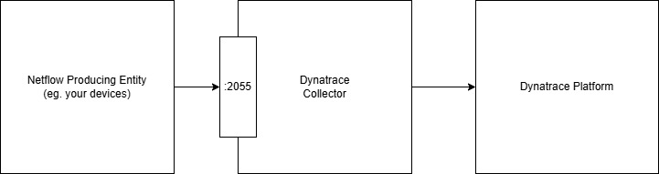

# Dynatrace Observability Lab: NetFlow Data Ingest

--8<-- "snippets/disclaimer.md"
--8<-- "snippets/view-code.md"
--8<-- "snippets/bizevent-homepage.js"

This hands on Observability Lab will show how to ingest NetFlow data into Dynatrace as log entries via the [Dynatrace collector](https://docs.dynatrace.com/docs/extend-dynatrace/opentelemetry/collector){target=_blank}.

A dummy NetFlow producing device ([nflow-generator](https://github.com/nerdalert/nflow-generator){target=_blank}) will be used for this demo. In reality, your devices would be configured to send flow data to the Dynatrace collector.

nflow-generator will be configured to send flow data to the Dynatrace collector. The Dynatrace collector will be configured to send the data to Dynatrace.

!!! info "More than just NetFlow"
    In this demo we use NetFlow data but the Dynatrace collector, and more specifically the [netflow receiver](https://github.com/open-telemetry/opentelemetry-collector-contrib/tree/main/receiver/netflowreceiver){target=_blank} inside the collector, also supports IPFIX and sFlow.

!!! tip "Dynatrace Support"
    The Dynatrace OpenTelemetry collector distribution is recommended as a best practice for any deployment involving OpenTelemetry.
    
    It is also fully supported meaning you can raise support tickets.

- [Click here to begin :octicons-arrow-right-24:](getting-started.md)

