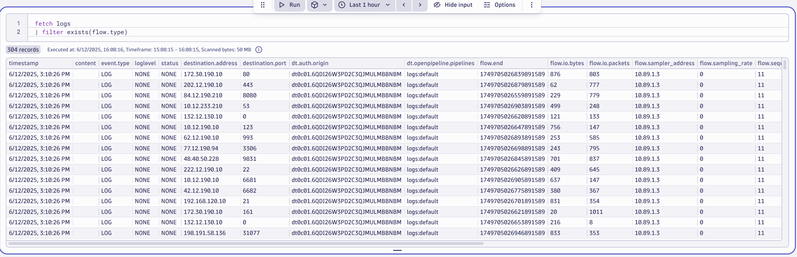

It is time to view the data in Dynatrace.

--8<-- "snippets/bizevent-view-data.js"

!!! tip "Data Ingest"
    It may take up to 30 seconds for data to appear in Dynatrace.
    Just re-run the command below after a minute or so.

In Dynatrace:

* Press `ctrl + k` search for `notebooks`
* Add a new section for `DQL`
* Search for:

```{ "name": "fetch log line" }
fetch logs
| filter exists(flow.type)
```




## Congratulations

You have succesfully ingested NetFlow data into Dynatrace.

This Observability lab is now complete.

--8<-- "snippets/feedback-invitation.md"

<div class="grid cards" markdown>
- [Click here to cleanup your environment :octicons-arrow-right-24:](cleanup.md)
</div>
